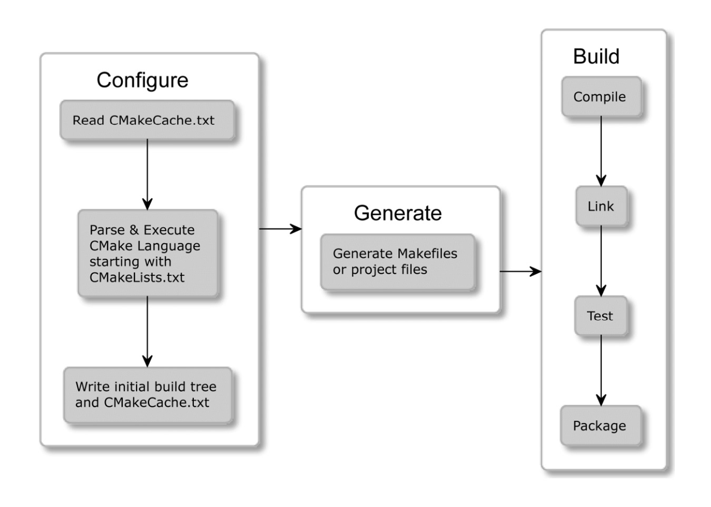

# Understanding the basic
Compilation of C/C++ code appears to be fairly simple.
```cpp
// hello.cpp
#include<iostream>
using namespace std;
int main() {
  cout << "Hello World!";
}
```
```sh
$> g++ -std=c++20 hello.cpp -o a.out 
$> ./a.out
Hello World
```
However, as Project grows. The manual Compilation of each file can be tiresome and fragile process.

`can we automate building ??`
building software is very versatile process.
1. Compiling executables and libraries
2. Managing Dependencies
3. Testing
4. Installing
5. Packaging
6. Producing documentation
7. Testing some more
Yes, Answer is `CMake, Make, Ninja` etc.
---

CMake is truly cross-platform - it supports Windows, Linux, macOS, Cygwin.

`How does it work?`<br>
there is three process.
1. Configuration
2. Generation
3. Building



# Mastering The Command Line
CMake is family of tools and consists of five executables.
- cmake : This is main executable that configures, generates and builds Projects.
- ctest : This is test driver program used to run and report tests results.
- cpack : This is packaging program used to generate installers and source packages.
- cmake-gui : this is gui wrapper around cmake.
- ccmake : this is console based gui wrapper around cmake.

# CMake
this binary provides a few modes of action.
- Generating a project build system
- Building a project
- Installing a project
- Running a script
- Running a Command line tool
- Getting Help

## Project Files

### The Source Tree : Project folder
- It requires that you provide a CMakeLists.txt Configuration file in its top directory.
- It should be managed with VCS like git
- The path to this directory is given by the user with a `-S` argument of the cmake command.
- avoid hardcoding any absolute paths.

### The Build Tree : build root
- binary files, libraries, objects, and everything generated during the build.
- do not add in VSC

```sh
$> cmake -B <build-tree-path> -S <project-folder-path>
$> cmake --build <build-tree-path>
```
