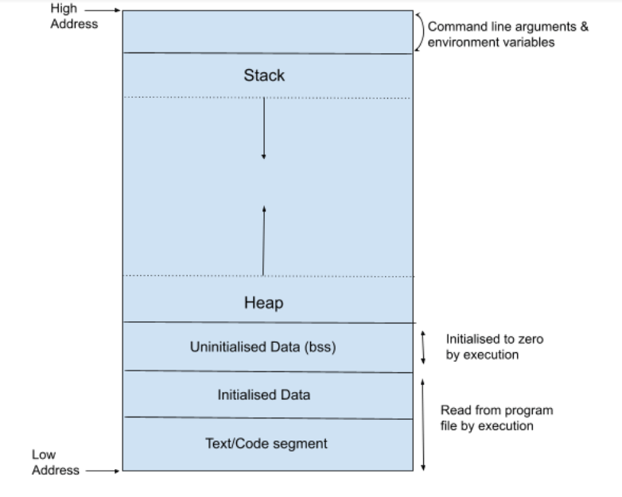

# Memory Layout

```cpp
#include <iostream>
class MyClass
{
public:
    static int _val;
};
int MyClass::_val = 12;
using namespace std;
int i;
static int j; // BSS DATA
int main(int argc, char **argv)
{
    int result = 0; // stack
    static int count = 0;  // initialized DATA segment
    static int count1; // BSS DATA (uninitialized)
    MyClass* myClass = new MyClass(); // Memory allocated from heap
    std::cout << myClass->_val;
    delete myClass; // delete myClass from heap
}
```
Scope: Lifetime<br>
`BSS DATA (uninitialized):` It contains global and static variables.<br>
`Initialized DATA:` It contains global and static variables initialized.<br>
`Note:` No object is created on heap, only memory allocated from heap
for variables and register in stack.<br>
`Segmentation fault:` When program tries to access memory that is not allowed to access or read/write memory that has not been allocated.

## 32bit Architecture object size
data type : size in bytes
1. char: `1`
2. short: `2`
3. int : `4`
4. float: `4`
5. long: `4`
6. pointer: `4`
7. long long: `8`
8. double: `8`
  
## Size of class
Size of class depends on 
1. Size of all non-static data members
2. order of data members
3. Byte alignment and byte padding
4. size of its immediate base class
5. virtual pointer
6. virtual interface
7. compiler used
